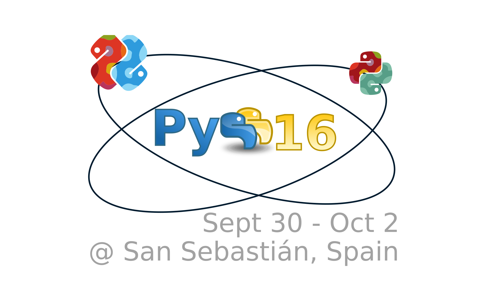

    <h1 style="text-align: center;">Deep Learning with Keras and Tensorflow</h1>
    

    

    

# Speaker: Valerio Maggio

### _PostDoc Data Scientist @ FBK/MPBA_

## Contacts:

<table style="border: 0px; display: inline-table">
    <tbody>
        <tr style="border: 0px;">
            <td style="border: 0px;">
                 
                <a href="http://twitter.com/leriomaggio">@leriomaggio</a>
            </td>
            <td style="border: 0px;">
                 
                <a href="http://plus.google.com/+ValerioMaggio">+ValerioMaggio</a>
            </td>
        </tr>
        <tr style="border: 0px;">
            <td style="border: 0px;">
                 
                <a href="it.linkedin.com/in/valeriomaggio">it.linkedin.com/in/valeriomaggio</a>
            </td>
            <td style="border: 0px;">
                 
                <a href="mailto:vmaggio@fbk.eu">vmaggio_at_fbk_dot_eu</a>
            </td>
       </tr>
  </tbody>
</table>

# Goal of this Tutorial

- **Introduce** main features of Keras
    - Plus some introductory overview of Tensorflow
    
- **Learn** how simple and Pythonic is doing Deep Learning with Keras

- **Understand** how easy is to do basic and *advanced* Deep Learning models in Keras;
    - **Examples and Hand-on Excerises** along the way.

# Source

This repository has been moved here: 
<a href="https://github.com/leriomaggio/deep-learning-keras-tensorflow/tree/pyss2016">
    https://github.com/leriomaggio/deep-learning-keras-tensorflow/tree/pyss2016
</a>